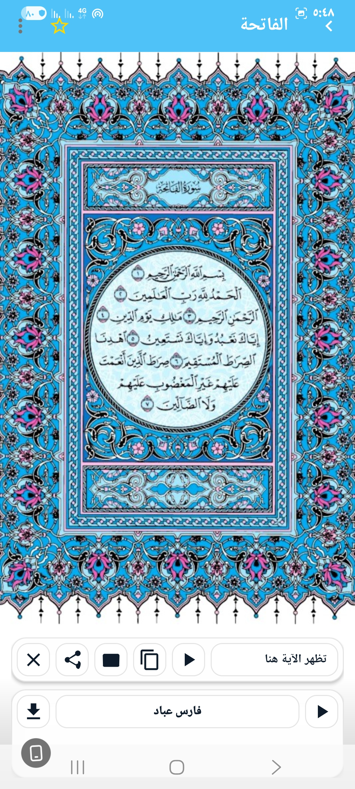
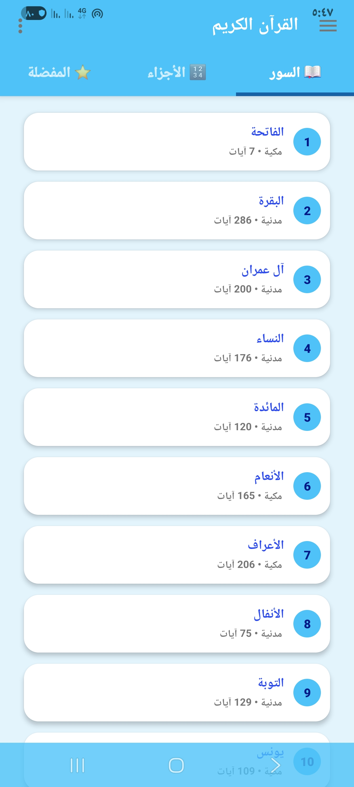

# 📖 القرآن الكريم (Holy Quran)

[](https://github.com/assadig3/Holy-Quran/releases)
[](https://github.com/assadig3/Holy-Quran/releases)
[](https://kotlinlang.org/)
[](LICENSE)

تطبيق **القرآن الكريم** لأجهزة أندرويد — واجهة عصرية وخفيفة مع دعم كامل للتلاوة، المفضلة، التفسير، وتكرار الآيات.

> ✨ آخر إصدار: **[v1.0.32](https://github.com/assadig3/Holy-Quran/releases/tag/v1.0.32)** — حمّل الـ APK من صفحة الإصدارات.

---

## ✨ المزايا
- 📚 **تصفح كامل السور والأجزاء** (مصحف المدينة).
- 🎧 **تشغيل التلاوة** باختيار القارئ (مع التحميل للاستخدام بدون إنترنت).
- 🔁 **تكرار آية/مجموعة آيات** بعدد مرات تحدده أنت.
- 🌍 **واجهات بعدة لغات** (العربية، الإنجليزية، التركية…إلخ).
- 🌙 **سِمة ليلية** وواجهة حديثة.
- ⭐ **المفضلة** لحفظ الصفحات.
- 📖 **التفسير** مع إمكانية المشاركة ونسخ الآية.

---

## 📸 صور من التطبيق

| الواجهة الرئيسية | قائمة السور | اختيار القارئ |
|---|---|---|
|  |  |  |

| اختيار اللغة | التفسير | إعدادات التكرار |
|---|---|---|
|  |  |  |

| حول التطبيق |
|---|
| .jpg>) |

> ملاحظة: تأكد من وجود مجلد **`screenshots/`** في جذر المستودع وبداخله الصور المشار لها بالأسماء أعلاه.

---

## 🚀 التثبيت والتشغيل (للمطورين)
1) استنساخ المستودع:
```bash
git clone https://github.com/assadig3/Holy-Quran.git
cd Holy-Quran
